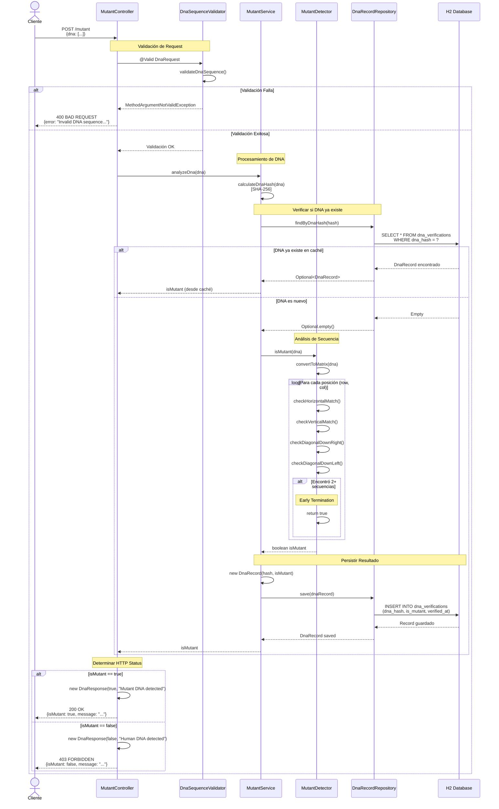
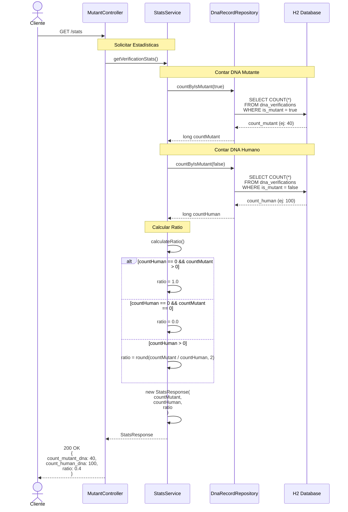
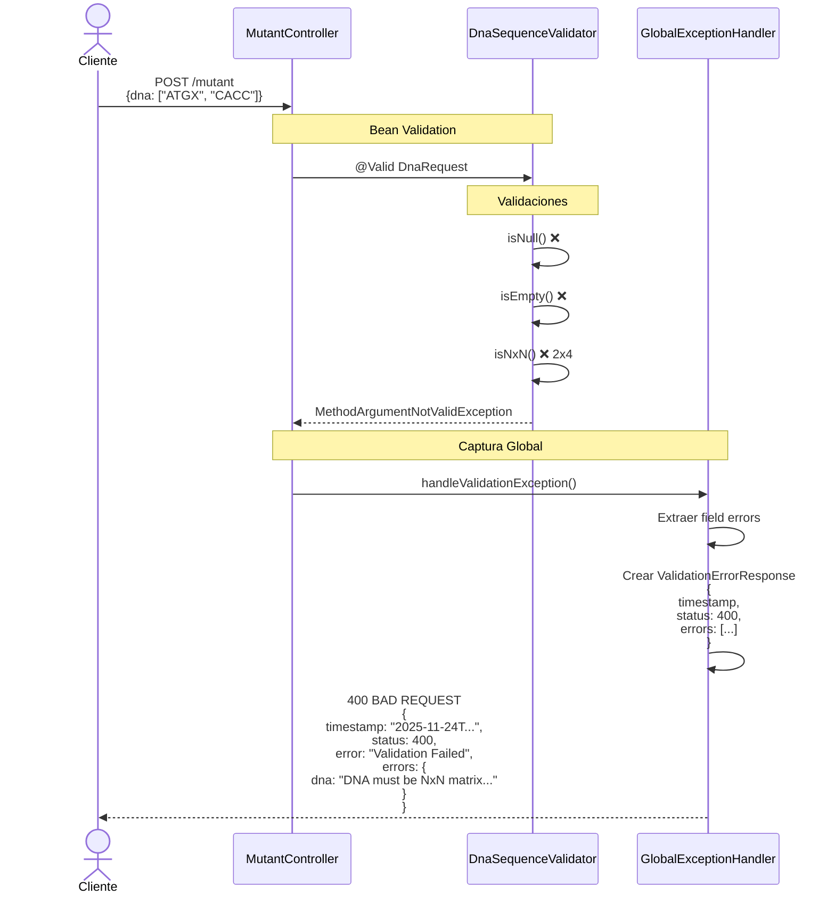
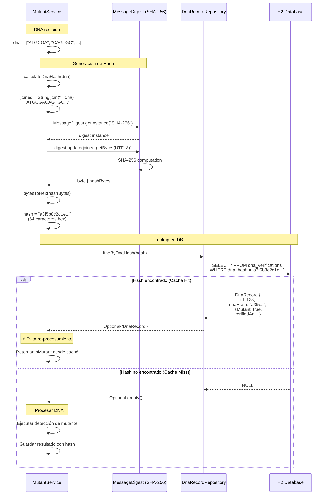
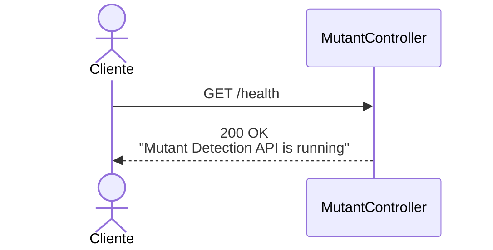
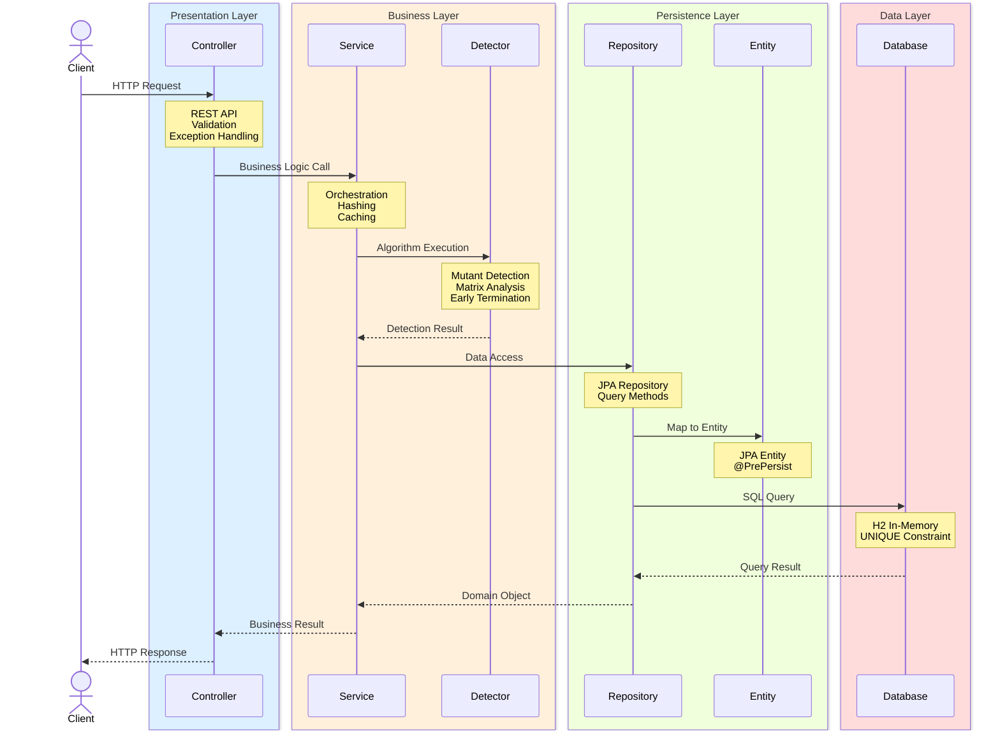
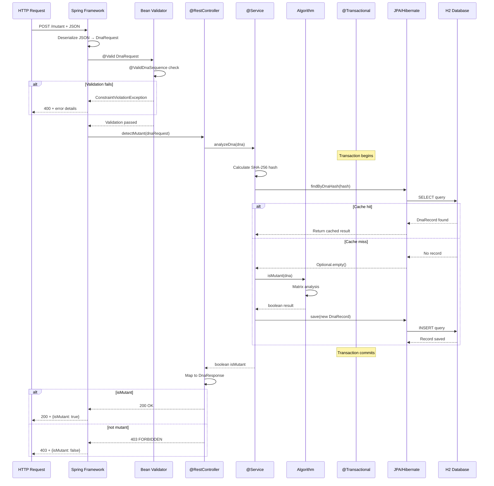

# 📊 Diagramas de Secuencia - Mutant Detection API

Este documento contiene los diagramas de secuencia completos para todos los endpoints y flujos de la aplicación.

---

## 🧬 1. POST /mutant - Detección de Mutantes

### Flujo Completo (con validación y caché)

---

## 📈 2. GET /stats - Estadísticas de Verificación

### Flujo Completo

---

## 🔍 3. Algoritmo de Detección de Mutantes (Detalle)

### Flujo Interno del MutantDetector

```mermaid
sequenceDiagram
    participant Service as MutantService
    participant Detector as MutantDetector
    participant Matrix as char[][]

    Service->>Detector: isMutant(dnaSequence)

    Note over Detector: Validación Inicial
    alt dnaSequence == null || empty
        Detector-->>Service: return false
    end

    Note over Detector,Matrix: Conversión a Matriz
    Detector->>Detector: convertToMatrix(dnaSequence)
    Detector->>Matrix: char[][] dnaMatrix
    Matrix-->>Detector: matriz creada

    Detector->>Detector: sequencesFound = 0<br/>gridSize = matrix.length

    Note over Detector: Loop Principal - Single Pass
    loop row = 0 to gridSize-1
        loop col = 0 to gridSize-1
            Detector->>Matrix: currentBase = matrix[row][col]

            Note over Detector: Check Horizontal →
            alt col <= gridSize - 4
                Detector->>Detector: checkHorizontalMatch(row, col, base)
                Detector->>Matrix: matrix[row][col+1] == base?
                Detector->>Matrix: matrix[row][col+2] == base?
                Detector->>Matrix: matrix[row][col+3] == base?

                alt Todas coinciden
                    Detector->>Detector: sequencesFound++

                    alt sequencesFound > 1
                        Note over Detector: ⚡ Early Termination
                        Detector-->>Service: return true
                    end
                end
            end

            Note over Detector: Check Vertical ↓
            alt row <= gridSize - 4
                Detector->>Detector: checkVerticalMatch(row, col, base)
                Detector->>Matrix: matrix[row+1][col] == base?
                Detector->>Matrix: matrix[row+2][col] == base?
                Detector->>Matrix: matrix[row+3][col] == base?

                alt Todas coinciden
                    Detector->>Detector: sequencesFound++

                    alt sequencesFound > 1
                        Note over Detector: ⚡ Early Termination
                        Detector-->>Service: return true
                    end
                end
            end

            Note over Detector: Check Diagonal ↘
            alt row <= gridSize - 4 && col <= gridSize - 4
                Detector->>Detector: checkDiagonalDownRight(row, col, base)
                Detector->>Matrix: matrix[row+1][col+1] == base?
                Detector->>Matrix: matrix[row+2][col+2] == base?
                Detector->>Matrix: matrix[row+3][col+3] == base?

                alt Todas coinciden
                    Detector->>Detector: sequencesFound++

                    alt sequencesFound > 1
                        Note over Detector: ⚡ Early Termination
                        Detector-->>Service: return true
                    end
                end
            end

            Note over Detector: Check Diagonal ↙
            alt row <= gridSize - 4 && col >= 3
                Detector->>Detector: checkDiagonalDownLeft(row, col, base)
                Detector->>Matrix: matrix[row+1][col-1] == base?
                Detector->>Matrix: matrix[row+2][col-2] == base?
                Detector->>Matrix: matrix[row+3][col-3] == base?

                alt Todas coinciden
                    Detector->>Detector: sequencesFound++

                    alt sequencesFound > 1
                        Note over Detector: ⚡ Early Termination
                        Detector-->>Service: return true
                    end
                end
            end
        end
    end

    Note over Detector: Fin del recorrido completo
    alt sequencesFound > 1
        Detector-->>Service: return true (mutante)
    else sequencesFound <= 1
        Detector-->>Service: return false (humano)
    end
```

---

## ⚠️ 4. Manejo de Excepciones

### Flujo de Validación y Manejo de Errores

---

## 🔐 5. Sistema de Deduplicación (SHA-256 Hashing)

### Flujo de Hash y Caché

---

## 🏥 6. Health Check

### Flujo Simple de Health Check

---

## 📊 7. Flujo Completo de Aplicación (Vista de Alto Nivel)

### Arquitectura en Capas

---

## 🔄 8. Ciclo de Vida de una Solicitud POST /mutant

### Desde Request hasta Response

---

## 📝 Notas Técnicas

### Convenciones de Diagramas

- **Líneas sólidas (→)**: Llamadas síncronas
- **Líneas punteadas (-->)**: Respuestas/retornos
- **Cajas "alt"**: Condicionales (if/else)
- **Cajas "loop"**: Iteraciones
- **Cajas "opt"**: Operaciones opcionales
- **Notas**: Contexto adicional

### Optimizaciones Destacadas

1. **Early Termination**: El detector termina inmediatamente al encontrar 2+ secuencias
2. **Hash-Based Caching**: Evita re-procesar DNA idéntico usando SHA-256
3. **Single Pass Algorithm**: Un solo recorrido de matriz verifica todas las direcciones
4. **Boundary Checking**: Previene lecturas fuera de límites sin try-catch
5. **Transaction Management**: `@Transactional` garantiza atomicidad

### Códigos HTTP Utilizados

| Código | Endpoint | Condición |
|--------|----------|-----------|
| 200 OK | POST /mutant | DNA mutante detectado |
| 200 OK | GET /stats | Estadísticas retornadas |
| 200 OK | GET /health | Servicio activo |
| 403 FORBIDDEN | POST /mutant | DNA humano detectado |
| 400 BAD REQUEST | POST /mutant | Validación fallida |
| 500 INTERNAL ERROR | Cualquiera | Error no manejado |

---

## 🎯 Puntos Clave de Arquitectura

1. **Separación de Responsabilidades**
   - Controller: HTTP handling + validation
   - Service: Business logic + orchestration
   - Repository: Data access abstraction
   - Detector: Core algorithm implementation

2. **Inmutabilidad de Datos**
   - DTOs con Lombok `@Data`
   - Entities con `@PrePersist` hooks
   - Hash-based identity sin modificación de data

3. **Validación en Capas**
   - Bean Validation en DTOs
   - Business validation en Services
   - Database constraints en Entities

4. **Gestión de Transacciones**
   - `@Transactional` en métodos de persistencia
   - Rollback automático en excepciones
   - Consistency garantizada

---

**Generado para**: Mutant Detection API v1.0.0
**Fecha**: 2025-11-24
**Tecnología**: Spring Boot 3.3.5 + Java 17
